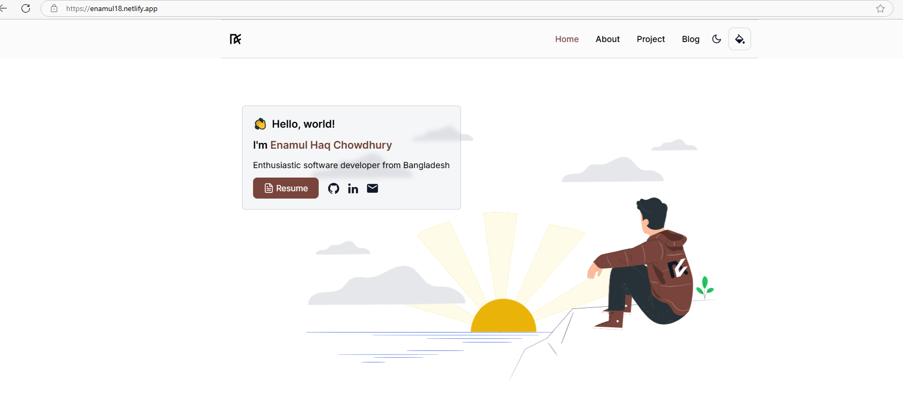

# [EnamulChowdhury.ec](https://enamul18.netlify.app/)


<picture>
  <source media="(prefers-color-scheme: dark)" srcset="./preview-dark.png">
  <source media="(prefers-color-scheme: light)" srcset="./preview.png">
  
</picture>

## Stack
- **Framework**: [Angular](https://angular.dev/)
- **Styling**: [Tailwind CSS](https://tailwindcss.com/)
- **Deployment**: [Netlify](https://www.netlify.com/)

## Features 📋
⚡️ Navbar Glassmorphism\
⚡️ Toolbar Color Theme Selector\
⚡️ Light and Dark Mode\
⚡️ Spotlight Glow Hover Card\
⚡️ Devicon with Tooltip\


## Sections 📚
✔️ Intro Image\
✔️ Expertise Area\
✔️ Languages and Tools\
✔️ About\
✔️ Projects\


## Running Locally

This application requires Node.js v18.13+.

```bash
npm install -g @angular/cli
git clone https://github.com/kaiyoken3618/Portfolio
cd kevinflor.es
npm install
```

run:
```bash
 npm start
```

Wait to compile and go to http://localhost:4200 after compile finish


